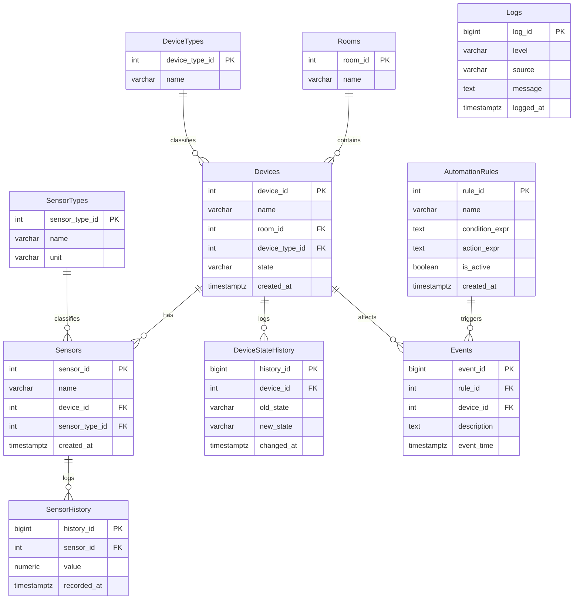

# SmartHomeDSL — база данных «Умный дом»

Проект: DSL (предметно-ориентированный язык) для управления умным домом на основе парадигмы потоков данных (Dataflow). Компонент — реляционная схема хранения состояния устройств, датчиков, автоматизации и истории событий.

## Стек

- СУБД: **PostgreSQL**
- Backend: **C# / .NET 8** (Npgsql)
- Файл инициализации БД: [`init.sql`](./init.sql)

## Состав базы

### Справочники
| Таблица | Назначение |
|---|---|
| `Rooms` | Помещения дома (6 шт.) |
| `DeviceTypes` | Типы устройств (Light, Climate, TV, Socket, Curtain, DoorLock, AirPurifier, Hood, Refrigerator, Oven, Dishwasher, Kettle, FloorHeating, Fan, Siren) |
| `SensorTypes` | Типы датчиков (Temperature, Humidity, Motion, Door, Smoke, Gas, CO2, Leak, LightLevel) |

### Основные сущности
| Таблица | Назначение |
|---|---|
| `Devices` | Устройства (26 шт.), привязаны к комнате и типу |
| `Sensors` | Датчики (18 шт.), привязаны к устройству и типу |
| `AutomationRules` | Правила автоматизации DSL (условие → действие) |

### История / Big Data (BIGINT PK, TIMESTAMPTZ, индексы по времени)
| Таблица | Назначение |
|---|---|
| `DeviceStateHistory` | История изменений состояния устройств |
| `SensorHistory` | История показаний датчиков |
| `Events` | События автоматизации (срабатывание правил / ручные действия) |
| `Logs` | Системные логи приложения |

## Связи (Foreign Keys)

1. `Rooms (1:N) Devices`
2. `DeviceTypes (1:N) Devices`
3. `SensorTypes (1:N) Sensors`
4. `Devices (1:N) Sensors`
5. `Devices (1:N) DeviceStateHistory`
6. `Sensors (1:N) SensorHistory`
7. `AutomationRules (1:N) Events`
8. `Devices (1:N) Events`
9. `Logs` — независимая таблица системных логов, не связана FK с остальными сущностями

## ER-диаграмма



## Помещения (seed data)

Прихожая, Гостиная, Спальня, Кухня, Ванная, Балкон.

## Big Data оптимизация

В таблицах `DeviceStateHistory`, `SensorHistory`, `Events`, `Logs`:
- первичный ключ `BIGINT GENERATED ALWAYS AS IDENTITY` (под большой объем данных);
- `TIMESTAMPTZ` для меток времени;
- `CREATE INDEX` по полям времени (`changed_at`, `recorded_at`, `event_time`, `logged_at`) для ускорения выборок и партиционирования в будущем.

## Развертывание

```bash
psql -U postgres -d SmartHomeDB -f init.sql
```
