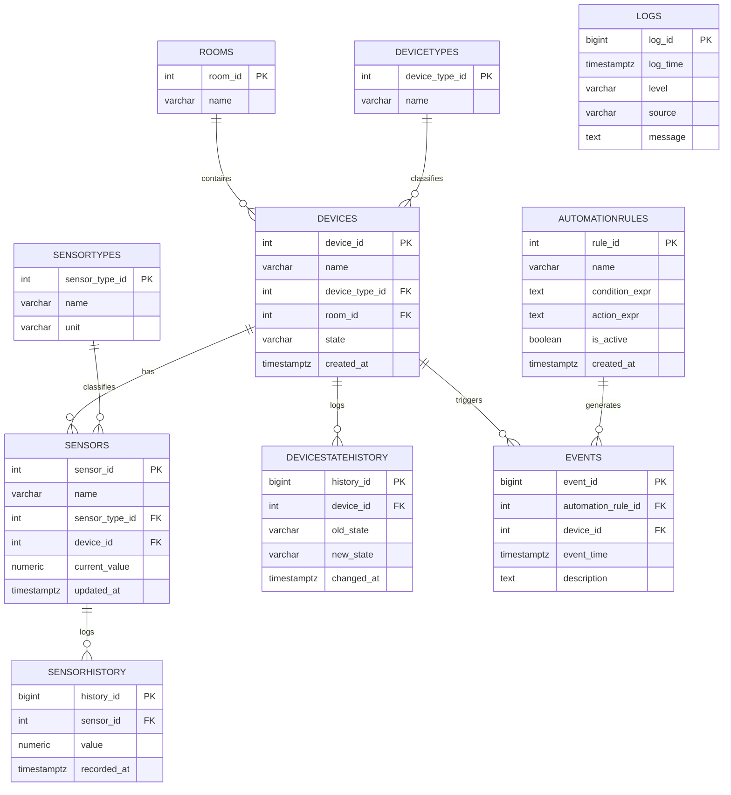

# SmartHomeDSL — база данных «Умный дом»
 
Проект: DSL (предметно-ориентированный язык) для управления умным домом на основе парадигмы потоков данных (Dataflow). Данный раздел — реляционная схема хранения состояния устройств, датчиков, правил автоматизации и истории событий.

## Стек

- СУБД: **PostgreSQL**
- Backend: **C# / .NET 8** (Npgsql)
- Файл инициализации БД: [`init.sql`](./init.sql)

## Помещения (6)

Прихожая, Гостиная, Спальня, Кухня, Ванная, Балкон.

## Состав базы

### Справочники
| Таблица | Назначение |
|---|---|
| `Rooms` | Помещения дома (6 шт.) |
| `DeviceTypes` | Типы устройств: Light, Climate, TV, Socket, Curtain, DoorLock, AirPurifier, Hood, Refrigerator, Oven, Dishwasher, Kettle, FloorHeating, Fan, Siren |
| `SensorTypes` | Типы датчиков: Temperature, Humidity, Motion, Door, Smoke, Gas, CO2, Leak, LightLevel |

### Основные сущности
| Таблица | Назначение |
|---|---|
| `Devices` | Устройства (26 шт.), привязаны к комнате и типу |
| `Sensors` | Датчики (18 шт.), привязаны к устройству и типу |
| `AutomationRules` | Правила автоматизации DSL (условие → действие) |

### История и Big Data (BIGINT PK, TIMESTAMPTZ, индексы по времени)
| Таблица | Назначение |
|---|---|
| `DeviceStateHistory` | История изменения состояний устройств |
| `SensorHistory` | История показаний датчиков |
| `Events` | События автоматизации (связаны с правилом и/или устройством) |
| `Logs` | Системные логи приложения (независимы от Events) |

## Связи

1. `Rooms` (1:N) `Devices`
2. `DeviceTypes` (1:N) `Devices`
3. `SensorTypes` (1:N) `Sensors`
4. `Devices` (1:N) `Sensors`
5. `Devices` (1:N) `DeviceStateHistory`
6. `Sensors` (1:N) `SensorHistory`
7. `AutomationRules` (1:N) `Events`
8. `Devices` (1:N) `Events`
9. `Logs` — независимая таблица системных логов, `Events` — таблица событий автоматизации

## ER-диаграмма



## Быстрый старт

```bash
psql -U postgres -d SmartHomeDB -f init.sql
```
